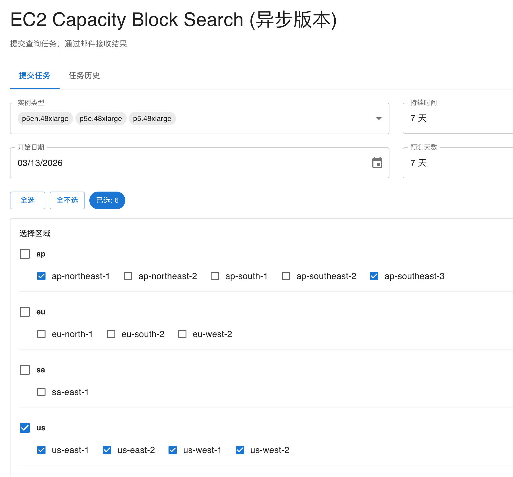
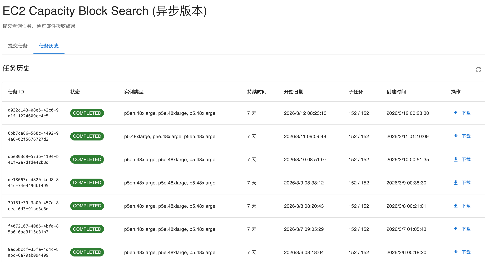

# EC2 Capacity Block Search

中文 | [English](README.en.md)

Async EC2 Capacity Block search system based on a task queue.

## 🎯 Features

- ✅ **Async Task Processing**: Uses Step Functions to orchestrate long-running queries
- ✅ **Smart Rate Limiting**: Serial queries per region to avoid API throttling
- ✅ **Binary Search**: Efficiently finds maximum available capacity (1–64 instances)
- ✅ **Auto Retry**: Automatically retries on throttling errors up to 3 times
- ✅ **Email Notification**: Sends email via SNS upon task completion
- ✅ **Result Persistence**: CSV files stored in S3, available for download
- ✅ **Task History**: View all submitted tasks and their statuses
- ✅ **Automatic Instance Discovery**: instance types that are **actually purchasable via Capacity Blocks** (and their supported regions) are discovered via the EC2 API (at deploy time and daily) — no manual maintenance
- ✅ **Real-time Pricing**: Per-accelerator hourly rate is derived from the actual `UpfrontFee`; no hardcoded prices

## 📷 Preview



Query across multiple regions, instance types, and custom time ranges from the console.



View task history and download results at any time.

## 🏗️ Architecture

```
Frontend (React)
    ↓
API Gateway (REST API + API Key)
    ↓
Lambda: SubmitTask
    ├─ Create task metadata (DynamoDB)
    └─ Start Step Functions
        ↓
    Step Functions
        ├─ Map (Region concurrent)
        │   └─ Map (subtasks serial, 10s interval)
        │       └─ Lambda: QueryCapacity (binary search)
        │           └─ Write results (DynamoDB)
        ├─ Lambda: AggregateResults (generate CSV → S3)
        └─ Lambda: SendNotification (SNS email)
```

## 📊 Data Flow

1. **User submits task** → API Gateway → SubmitTask Lambda
2. **Create task record** → DynamoDB Tasks table
3. **Start workflow** → Step Functions
4. **Concurrent queries** → Multiple regions execute simultaneously
5. **Serial subtasks** → Serial queries within each region (avoids throttling)
6. **Binary search** → Binary search over 1–64 instance counts
7. **Save results** → DynamoDB Results table
8. **Generate CSV** → S3 Bucket
9. **Send notification** → SNS Topic → Email

## 🗂️ Project Structure

```
capacity_block_search_async/
├── backend/                    # Lambda functions
│   ├── query_capacity.py      # Binary search core logic
│   ├── submit_task.py          # Submit task
│   ├── refresh_instance_types.py  # Discover instance types via EC2 API, refresh SSM
│   ├── aggregate_results.py    # Aggregate results and generate CSV (rate derived from UpfrontFee)
│   ├── send_notification.py    # Send email notification
│   ├── update_task_status.py   # Update task status
│   ├── handle_failure.py       # Error handling
│   ├── list_tasks.py           # List tasks
│   ├── get_task_results.py     # Get result URL
│   └── requirements.txt
├── infrastructure/             # CDK infrastructure
│   ├── app.py                  # CDK entry point
│   ├── capacity_block_async_stack.py  # Stack definition
│   ├── cdk.json
│   └── requirements.txt
├── frontend/                   # React frontend
│   └── src/
│       └── data/
│           └── instanceTypes.json  # Deploy-time seed / fallback; refreshed at runtime via EC2 API
└── README.md
```

> 💡 **Instance types and pricing are both dynamic**
> - Instance list: the `RefreshInstanceTypes` Lambda discovers instance types at **deploy time** (CDK Trigger) and **daily** (EventBridge), then writes them to an SSM Parameter served by the `/config` endpoint. Discovery is two-step: first `DescribeInstanceTypeOfferings` / `DescribeInstanceTypes` find the P/Trn accelerated types and accelerator specs per region, then `DescribeCapacityBlockOfferings` **verifies per (type, region) whether Capacity Block purchase is actually supported** — only purchasable combinations are listed (non-CB types like p3dn and trn1.2xlarge are excluded, as are regions with no CB API; CB support also varies by region for the same type, e.g. p4d only in us-east-1/us-east-2/us-west-2). `instanceTypes.json` is only a fallback seed. **No code change is needed** when new instance types launch.
> - Per-accelerator rate: derived from the real `UpfrontFee` returned by `describe_capacity_block_offerings` as `UpfrontFee / (InstanceCount × acceleratorCount × DurationHours)` — no hardcoded prices, no extra API calls.

## 🚀 Quick Start

### Prerequisites

- AWS CLI configured
- Node.js 18+
- Python 3.12+ (to run CDK locally; the Lambda runtime is Python 3.14)
- AWS CDK CLI: `npm install -g aws-cdk`
- Valid AWS account and permissions

### 1. Deploy Backend

```bash
cd infrastructure
pip install -r requirements.txt
cdk bootstrap  # first-time only
cdk deploy
```

After deployment, note the following output values:
- `ApiEndpoint`: API Gateway URL
- `ApiKeyId`: API Key ID
- `SnsTopicArn`: SNS Topic ARN
- `ResultsBucketName`: S3 Bucket name
- `TasksTableName`: Tasks table name
- `ResultsTableName`: Results table name

### 2. Retrieve API Key

```bash
# Use ApiKeyId to get the API Key value
aws apigateway get-api-key \
  --api-key <ApiKeyId> \
  --include-value \
  --query 'value' \
  --output text
```

Save this API Key value — you'll need it when configuring the frontend.

### 3. Configure SNS Subscription

```bash
aws sns subscribe \
  --topic-arn <SnsTopicArn> \
  --protocol email \
  --notification-endpoint your@email.com
```

### 4. Frontend Local Testing and Cloud Deployment

See [README.md](/frontend/README.md)

## 🔒 Security Recommendations

This sample protects its API with an **API Key only**, and that key is bundled into the frontend build (it is public information, **not an authentication mechanism**). Before using it in production or exposing it publicly, we strongly recommend:

- **Enable AWS WAF** on API Gateway and/or the Amplify app to restrict origins, rate-limit, and block malicious traffic.
- **Require login for the frontend**: if you deploy the frontend via **AWS Amplify Hosting**, enable Amplify **Access control (username/password Basic Auth)** so the page — and the API key embedded in it — is not publicly accessible.
- **Add real API authentication** such as Amazon Cognito, IAM, or a Lambda Authorizer, to replace/augment the API Key.
- **Tighten CORS** to your frontend domain instead of `*`.
- **Harden the S3 results bucket**: explicitly enable Block Public Access, default encryption, and enforce SSL.

## ⚠️ Disclaimer

This project is **sample/demo code** intended for demonstration and learning purposes only. It is provided **"AS IS"** without warranties of any kind, express or implied. Do not use it in production without a thorough security review and hardening. You assume all risks and costs arising from its use (including but not limited to AWS resource charges, data security, and compliance). This project does not represent an official AWS position.

## Security

See [CONTRIBUTING](CONTRIBUTING.md#security-issue-notifications) for more information.

## License

This library is licensed under the MIT-0 License. See the LICENSE file.
