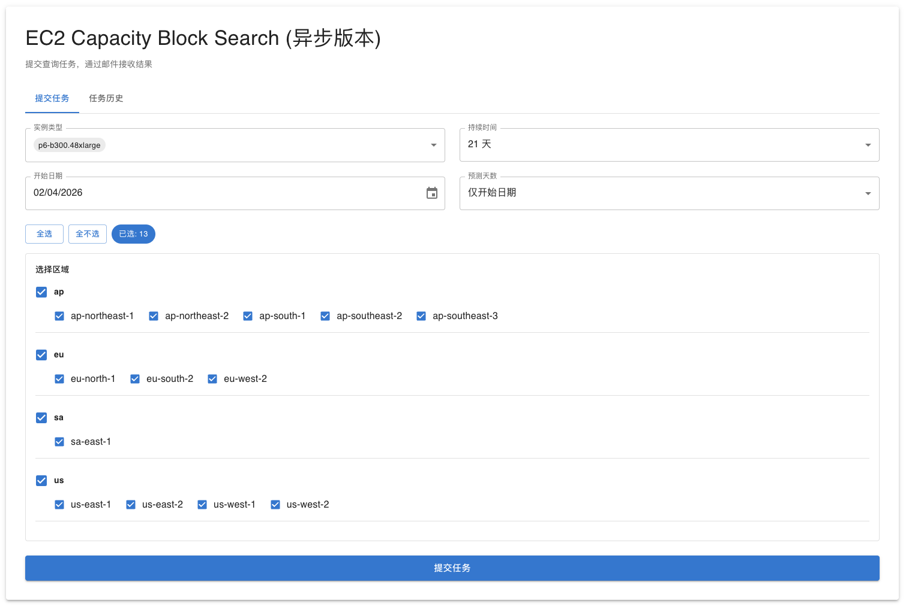
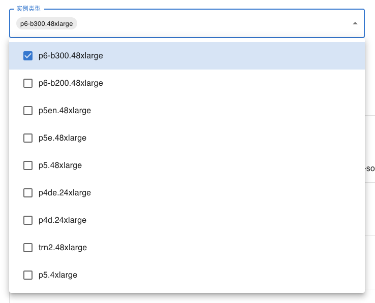
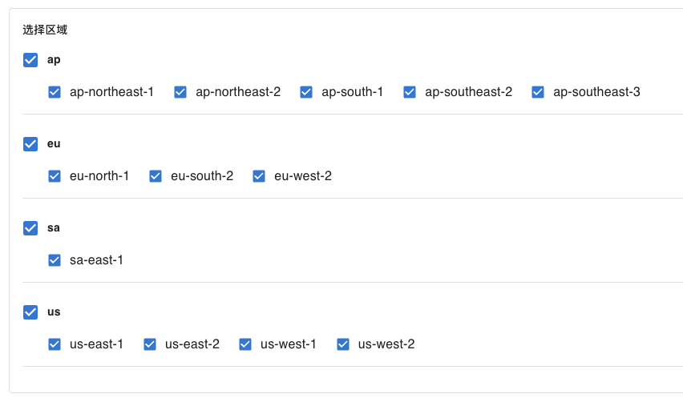
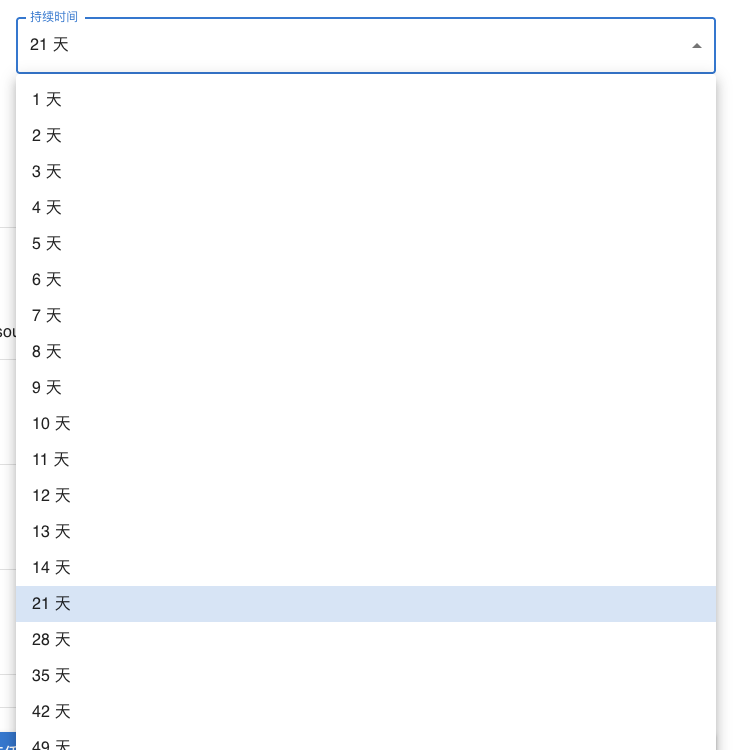
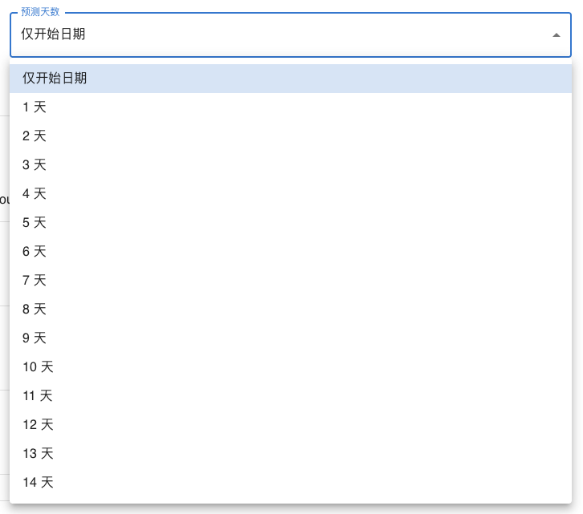
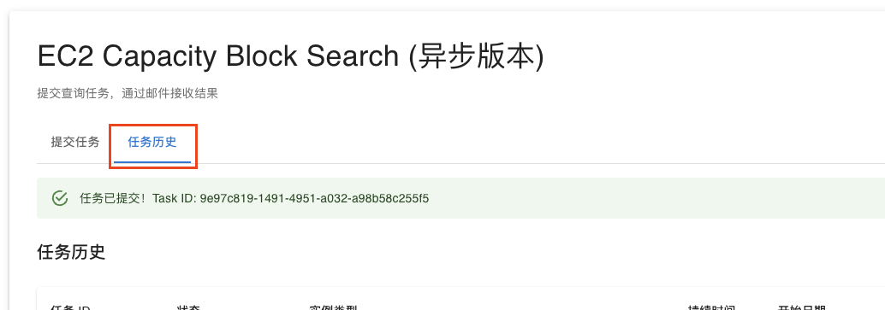
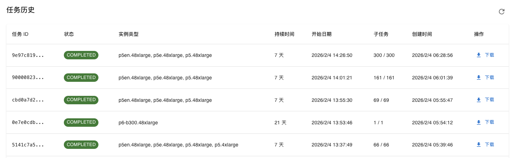

# EC2 Capacity Block Search - 用户使用指南

本文档介绍如何使用前端界面查询 EC2 Capacity Block 容量。

## 📋 目录

- [快速开始](#快速开始)
- [功能介绍](#功能介绍)
- [使用步骤](#使用步骤)
- [查询参数说明](#查询参数说明)
- [结果解读](#结果解读)
- [常见问题](#常见问题)

---

## 快速开始

### 访问应用

打开浏览器，访问您的应用地址：
- **生产环境**: `https://xxxxx.amplifyapp.com`
- **本地开发**: `http://localhost:3000`

---

## 功能介绍

### 主要功能

1. **容量查询** - 查询指定实例类型在不同区域的可用容量
2. **任务管理** - 查看历史查询任务及状态
3. **结果下载** - 下载 CSV 格式的查询结果
4. **邮件通知** - 任务完成后自动发送邮件通知

### 页面布局



---

## 使用步骤

### 步骤 1: 新建查询任务

#### 1.1 选择实例类型

在"实例类型"下拉框中选择要查询的实例类型：

- **p5.48xlarge** - NVIDIA H100 GPU 实例
- **p5e.48xlarge** - NVIDIA H200 GPU 实例
- **p4d.24xlarge** - NVIDIA A100 GPU 实例
- 等等...

**提示**: 可以添加多个实例类型进行批量查询

> ℹ️ 下拉框中的机型列表由系统通过 EC2 API 自动发现（每日刷新），涵盖当前所有支持 Capacity Block 的 P/Trn 加速机型及其可用区域。有新机型上线时会自动出现，无需人工维护。



#### 1.2 选择区域

为每个实例类型选择要查询的 AWS 区域：

- **us-east-1** (美国东部 - 弗吉尼亚)
- **us-west-2** (美国西部 - 俄勒冈)
- **eu-west-1** (欧洲 - 爱尔兰)
- **ap-northeast-1** (亚太 - 东京)
- 等等...

**提示**: 
- 可以为每个实例类型选择不同的区域
- 建议选择 2-5 个区域，避免查询时间过长



#### 1.3 设置查询参数

**持续时间 (Duration)**
- 容量块的**预留时长（租期）**——你要占用这批加速卡多少天
- 决定结束日期：结束日期 = 开始日期 + 持续时间
- 可选值: 1, 2, 3 ... 14, 21, 28 ...
- 默认: 21 天



**开始日期 (Start Date)**
- 容量块的开始时间
- 格式: YYYY-MM-DD HH:mm
- 必须是未来时间，默认为今天


**预测天数 (Forecast Days)**
- 从开始日期起**逐天顺延、分别查询**的天数——用来看哪几天有容量，**不影响租期**
- 范围: 0-14 天
- 默认: 0 天 （仅查询开始日期当天）；选 N 则查开始日期起连续 N+1 个起始日



> ℹ️ **持续时间 vs 预测天数**：前者是「用多久」（租期长度），后者是「从哪天起找货」（查询的起始日个数），两者相互独立。
> 例：开始日期 10/01、持续时间 7 天、预测天数 3 天 → 会分别查询 10/01、10/02、10/03、10/04 共 4 个起始日，每个都寻找一个 **7 天**的容量块。

#### 1.4 提交查询

点击"提交查询"按钮

提交后会显示确认信息：

```
✅ 任务已提交！
任务 ID: abc-123-def-456
```

---

### 步骤 2: 查看任务状态

#### 2.1 切换到"任务历史"标签



#### 2.2 任务列表

查看所有提交的任务：



#### 2.3 任务状态说明

| 状态名称 | 说明 |
|---------|------|
| PENDING | 任务已提交，等待执行 |
| RUNNING | 任务正在执行中 |
| COMPLETED | 任务已完成，可以下载结果 |
| FAILED | 任务执行失败 |
| TIMEOUT | 任务超时 |

---

### 步骤 3: 下载结果

#### 3.1 下载 CSV 文件

点击"下载 CSV 结果"按钮，下载的 CSV 文件包含以下列（每个可用的 offering 一行）：

| 列名 | 说明 | 示例 |
|------|------|------|
| Region | AWS 区域 | us-east-1 |
| Searched Instance Type | 查询的实例类型 | p5.48xlarge |
| Search Date | 查询的起始日期 | 2026-10-01 |
| Instance Count | 该起始日找到的最大可用实例数 | 8 |
| Rate per Accelerator (USD) | 每加速卡时价（由 Upfront Fee 反算，实时） | 3.933 |
| Accelerator Type | 加速卡型号 | H100 |
| Accelerator Count | 每实例加速卡数 | 8 |
| Total Accelerator Count | 加速卡总数 (Instance Count × Accelerator Count) | 64 |
| Capacity Block ID | 容量块 offering ID | cbr-0abc123... |
| Actual Instance Type | offering 实际实例类型 | p5.48xlarge |
| Start Date (Beijing Time) | 容量块开始时间（北京时间 UTC+8） | 2026-10-02 08:00:00 |
| End Date (Beijing Time) | 容量块结束时间（北京时间 UTC+8） | 2026-10-09 08:00:00 |
| Duration (hours) | 容量块时长（小时） | 168 |
| Availability Zone | 可用区 | use1-az4 |
| Upfront Fee | 一次性预付总费用（真实 API 返回） | 4762.94 |
| Currency Code | 货币 | USD |
| Status | 状态 | Available |

> ℹ️ 「Rate per Accelerator (USD)」（每加速卡时价）由该 offering 的真实 `Upfront Fee` 反算得出（`Upfront Fee / (Instance Count × Accelerator Count × Duration Hours)`），为实时价格、非写死值；仅在该时段有可用容量（有 offering）时才有数值。

---


## 常见问题

### Q1: 查询需要多长时间？

**A**: 取决于查询参数：
- 单个实例类型 + 单个区域 + 1 天: ~20 秒
- 2 个实例类型 + 3 个区域 + 3 天: ~2-3 分钟
- 3 个实例类型 + 5 个区域 + 7 天: ~5-8 分钟

### Q2: 为什么有些查询显示"无容量"？

**A**: 可能的原因：
1. 该时段确实没有可用容量（最常见）
2. 实例类型在该区域不可用
3. 开始时间太近（建议至少提前 24 小时）

**解决方法**:
- 尝试其他日期
- 尝试其他区域
- 选择不同的实例类型

### Q3: 查询结果的容量是实时的吗？

**A**: 
- 查询结果反映查询时刻的容量
- 容量会随时变化，建议：
  - 查询后尽快预订
  - 定期重新查询
  - 设置邮件提醒

### Q4: 可以同时提交多个查询任务吗？

**A**: 
- 可以，系统支持并发任务
- 不过建议同时运行的任务不超过 1 个
- 多任务并发会导致任务出错率变高，查询变慢，因为接口有throttling机制。

### Q5: 任务失败了怎么办？

**A**: 
1. 查看任务详情中的错误信息
2. 常见错误：
   - **Throttling**: 系统已自动重试，无需操作
   - **Invalid Parameters**: 检查查询参数
   - **Timeout**: 减少查询范围后重试
3. 如果持续失败，联系管理员

### Q6: 如何取消正在运行的任务？

**A**: 
- 当前版本不支持取消任务
- 任务会在 1 小时后自动超时
- 建议等待任务完成或超时

### Q7: 历史任务会保留多久？

**A**: 
- 任务记录: 永久保留
- CSV 结果文件: 永久保留，但邮件中的链接有效期为6小时。
- 建议及时下载重要结果

### Q8: 邮件通知包含什么信息？

**A**: 邮件包含：
- 任务 ID 和状态
- 查询参数摘要
- 结果下载链接（有效期6小时）
- 容量摘要（如果成功）

**示例邮件**:
```
主题: EC2 Capacity Block 查询完成

您的容量查询任务已完成！

任务 ID: abc-123-def-456
提交时间: 2026-02-04T06:28:56.887751
完成时间: 2026-02-04T06:58:00.545820
执行时间: 2 分 30 秒

查询参数：
- 实例类型: p5en.48xlarge, p5e.48xlarge, p5.48xlarge
- 持续时间: 7 天
- 开始日期: 2026-02-04T06:26:50.968Z
- 预测天数: 14
- 区域: ap-northeast-1, ap-northeast-2, ap-south-1, ap-southeast-2, us-east-1, us-east-2, us-west-1, us-west-2

结果摘要：
- 总查询数: 300 个
- 已完成: 300 个
- 失败: 0 个

下载结果 CSV：https://....
(链接有效期 6 小时)
```

### Q9: 如何批量查询多个实例类型？

**A**: 
1. 在"实例类型"部分点击"+ 添加实例类型"
2. 为每个实例类型选择区域
3. 所有实例类型共享相同的持续时间和日期参数
4. 一次提交即可查询所有组合

### Q10: 查询结果可以导出到 Excel 吗？

**A**: 
- 下载的 CSV 文件可以直接用 Excel 打开
- 或使用在线工具转换: [CSV to Excel](https://www.convertcsv.com/csv-to-excel.htm)

---

**祝您使用愉快！** 🎉
